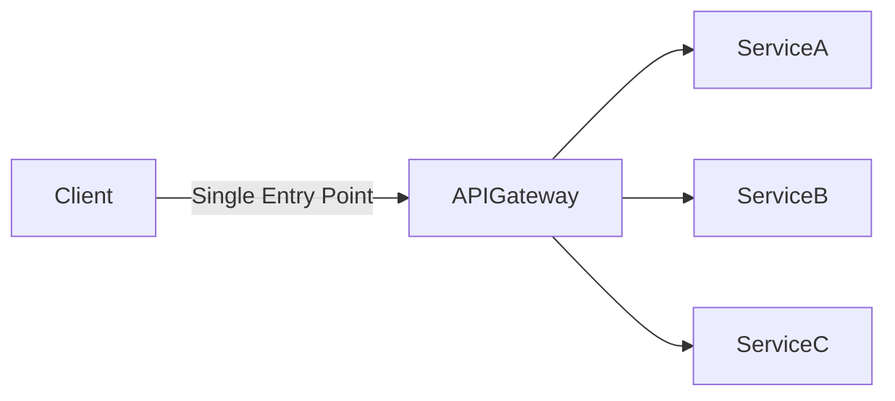

# What is an API Gateway and Its Role

## Introduction

An **API Gateway** is a server that acts as an intermediary between clients and backend services. It is a key component in modern microservices architectures, providing a single entry point for all client requests.

---

## Key Functions of an API Gateway

- **Request Routing:** Directs incoming client requests to the appropriate backend service.
- **Aggregation:** Combines responses from multiple services into a single response.
- **Protocol Translation:** Converts requests between different protocols (e.g., HTTP to WebSocket).
- **Authentication & Authorization:** Validates client credentials and enforces access control.
- **Rate Limiting & Throttling:** Controls the number of requests a client can make in a given time.
- **Caching:** Stores responses to reduce load on backend services and improve performance.
- **Logging & Monitoring:** Tracks requests and responses for auditing and troubleshooting.

---

## Why Use an API Gateway?

- **Simplifies Client Interaction:** Clients interact with a single endpoint instead of multiple services.
- **Centralized Security:** Security policies are enforced in one place.
- **Improved Scalability:** Offloads common tasks from backend services.
- **Flexibility:** Easily add, remove, or update backend services without affecting clients.

---

## Typical Architecture

---

## Example Use Cases

- Mobile and web applications accessing multiple microservices.
- Enforcing security and rate limits for public APIs.
- Aggregating data from several services for a dashboard.

---

## Conclusion

An API Gateway is essential for managing, securing, and optimizing communication between clients and backend services in modern application architectures.