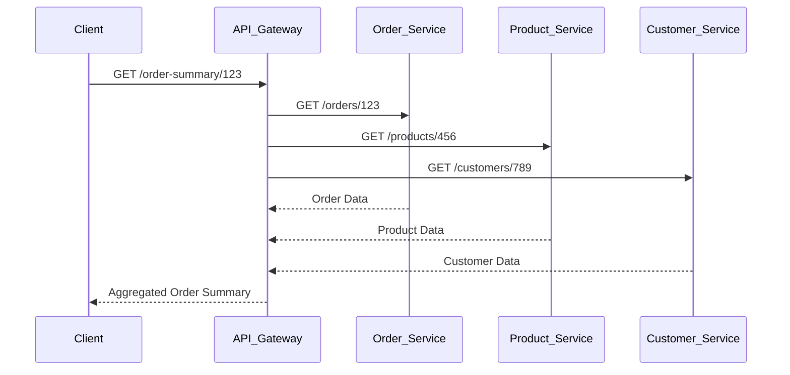

# API Composition for Aggregating Responses

API composition is a pattern used in API Gateway architecture to aggregate data from multiple microservices into a single response. This approach simplifies client interactions by reducing the number of requests and handling the complexity of data retrieval on the server side.

---

## Why Use API Composition?

- **Reduce client complexity:** Clients make a single request instead of multiple calls to different services.
- **Improve performance:** Aggregation at the gateway can reduce network latency and overhead.
- **Centralize logic:** Business logic for data composition is managed in one place.

---

## How API Composition Works

1. **Client Request:** The client sends a request to the API Gateway.
2. **Gateway Aggregation:** The gateway forwards requests to relevant microservices.
3. **Response Collection:** The gateway collects responses from each service.
4. **Data Composition:** The gateway merges or transforms the data as needed.
5. **Final Response:** The composed response is sent back to the client.

---

## Example Scenario

Suppose you have an e-commerce application with the following microservices:

- **Order Service:** Provides order details.
- **Product Service:** Provides product information.
- **Customer Service:** Provides customer details.

A client wants to view an order summary, including order info, product details, and customer info.

### API Composition Flow



---

## Sample Aggregation Code (Node.js/Express Example)

```js
const express = require('express');
const axios = require('axios');
const app = express();

app.get('/order-summary/:orderId', async (req, res) => {
  try {
    const orderId = req.params.orderId;
    // Fetch order details
    const order = await axios.get(`http://order-service/orders/${orderId}`);
    // Fetch product details
    const product = await axios.get(`http://product-service/products/${order.data.productId}`);
    // Fetch customer details
    const customer = await axios.get(`http://customer-service/customers/${order.data.customerId}`);

    // Compose response
    res.json({
      order: order.data,
      product: product.data,
      customer: customer.data
    });
  } catch (error) {
    res.status(500).json({ error: 'Failed to aggregate data' });
  }
});

app.listen(3000, () => console.log('API Gateway running on port 3000'));
```

---

## Best Practices

- **Error Handling:** Gracefully handle failures from downstream services.
- **Caching:** Cache aggregated responses when possible to improve performance.
- **Timeouts:** Set timeouts for service calls to avoid long waits.
- **Scalability:** Ensure the gateway can handle increased load due to aggregation logic.

---

## Summary

API composition in an API Gateway enables efficient data aggregation from multiple microservices, providing a unified and simplified API for clients. This pattern is essential for microservice-based architectures where data is distributed across services.
