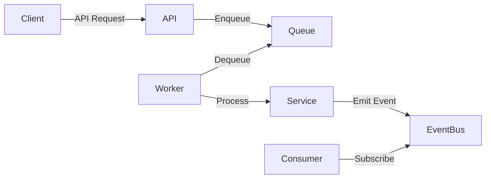

# Designing for Asynchronous Processing and Event-Driven Architectures

Modern API development often requires handling high loads, improving responsiveness, and scaling efficiently. Asynchronous processing and event-driven architectures are key patterns to achieve these goals.

---

## 1. What is Asynchronous Processing?

Asynchronous processing allows tasks to run independently of the main application flow. Instead of waiting for a task to complete, the application can continue executing other operations.

**Benefits:**

- Improved responsiveness
- Better resource utilization
- Enhanced scalability

**Common Use Cases:**

- Sending emails
- Processing images or files
- Integrating with third-party services

---

## 2. Event-Driven Architecture Overview

Event-driven architecture (EDA) is a design pattern where components communicate by emitting and responding to events.

**Core Concepts:**

- **Event:** A significant change in state (e.g., "OrderPlaced").
- **Producer:** Component that emits events.
- **Consumer:** Component that listens for and processes events.
- **Event Bus/Broker:** Middleware that routes events (e.g., RabbitMQ, Kafka).

**Benefits:**

- Loose coupling between components
- Scalability and flexibility
- Real-time processing

---

## 3. Implementing Asynchronous Processing

### a. Message Queues

Use message queues to decouple producers and consumers.

**Popular Tools:**

- RabbitMQ
- Apache Kafka
- AWS SQS

**Example Flow:**

1. API receives a request to process a large file.
2. API enqueues a message with file details.
3. Worker service dequeues and processes the file asynchronously.

### b. Background Jobs

Frameworks like Celery (Python), Sidekiq (Ruby), or Spring Boot's `@Async` (Java) allow background job processing.

**Example (Java Spring Boot):**

```java
@Async
public void processOrder(Order order) {
    // Long-running task
}
```

---

## 4. Designing Event-Driven APIs

### a. Event Publishing

APIs can emit events when significant actions occur (e.g., user registration).

**Example:**

- User signs up → API publishes `UserRegistered` event.

### b. Event Consumption

Other services subscribe to relevant events and react accordingly.

**Example:**

- `UserRegistered` event triggers a welcome email service.

---

## 5. Best Practices

- **Idempotency:** Ensure event handlers can safely process the same event multiple times.
- **Error Handling:** Implement retries and dead-letter queues for failed messages.
- **Monitoring:** Track event flows and queue lengths for bottlenecks.
- **Documentation:** Clearly document emitted events and their payloads.

---

## 6. Example Architecture Diagram



---

## 7. Conclusion

Designing APIs for asynchronous processing and event-driven architectures enhances scalability, reliability, and maintainability. Adopt these patterns to build robust, modern applications.
