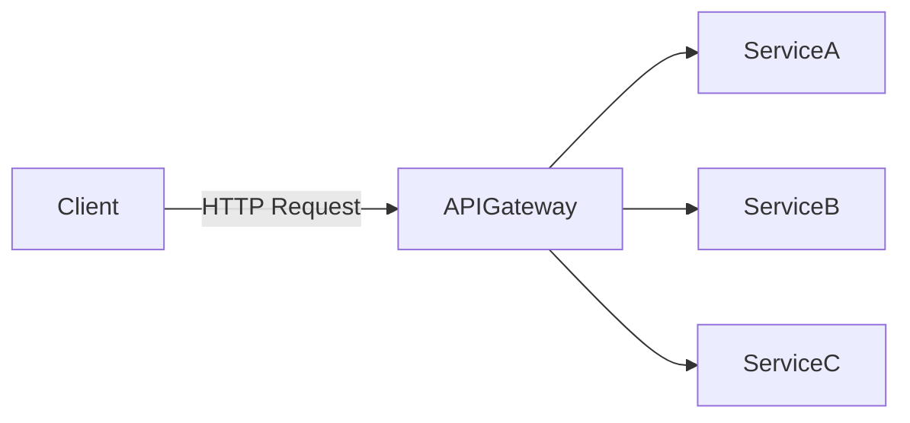

# Role of API Gateways in Microservices Architectures

## Introduction

API gateways are a critical component in microservices architectures. They act as a single entry point for client requests, routing them to the appropriate microservice, and handling cross-cutting concerns such as authentication, logging, and rate limiting.

---

## Why Use an API Gateway?

- **Centralized Access Point:** Simplifies client interactions by exposing a unified API.
- **Security:** Handles authentication, authorization, and input validation.
- **Load Balancing:** Distributes incoming requests across multiple service instances.
- **Protocol Translation:** Converts between protocols (e.g., HTTP to gRPC).
- **Request Aggregation:** Combines responses from multiple microservices into a single response.
- **Rate Limiting & Throttling:** Protects backend services from overload.

---

## Common Responsibilities

| Responsibility         | Description                                              |
|------------------------|---------------------------------------------------------|
| Routing                | Directs requests to the correct microservice            |
| Authentication         | Verifies user identity before forwarding requests       |
| Authorization          | Ensures users have permission to access resources       |
| Response Transformation| Modifies responses before sending to the client         |
| Caching                | Stores responses to reduce load and improve performance |
| Monitoring & Logging   | Tracks requests and logs activity for analysis          |

---

## Example Architecture

---

## Popular API Gateway Solutions

- **Kong**
- **NGINX**
- **AWS API Gateway**
- **Zuul (Netflix)**
- **Traefik**

---

## Challenges

- **Single Point of Failure:** If the gateway goes down, all services become inaccessible.
- **Performance Bottleneck:** Can become a bottleneck if not properly scaled.
- **Complexity:** Adds another layer to the architecture that must be managed and maintained.

---

## Conclusion

API gateways simplify client interactions with microservices, centralize cross-cutting concerns, and improve security and scalability. However, they must be carefully designed and managed to avoid introducing new challenges.
