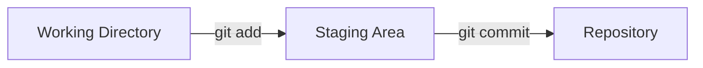

# Understanding Working Directory, Staging Area, and Repository

When using Git, it's important to understand the three main areas where your files can exist: the **working directory**, the **staging area**, and the **repository**. Each area plays a specific role in the version control workflow.

---

## 1. Working Directory

- **Definition:**  
    The working directory is the folder on your computer where you create, edit, and delete files for your project.
- **Purpose:**  
    This is where you make changes to your project files before telling Git to track them.
- **Example:**  
    When you open your project folder and edit a file, you are working in the working directory.

---

## 2. Staging Area (Index)

- **Definition:**  
    The staging area is a place where you can group changes before committing them to the repository.
- **Purpose:**  
    It allows you to decide which changes you want to include in your next commit.
- **How to Use:**  
    You add files to the staging area using the command:

    ```bash
    git add <filename>
    ```

- **Example:**  
    If you edit three files but only want to commit one, you can add just that file to the staging area.

---

## 3. Repository (Local Repository)

- **Definition:**  
    The repository is the database where Git permanently stores your project history as a series of commits.
- **Purpose:**  
    It keeps track of all committed changes, allowing you to review or revert to previous versions.
- **How to Use:**  
    You save changes from the staging area to the repository using:

    ```bash
    git commit -m "Your commit message"
    ```

- **Example:**  
    After committing, your changes are safely stored in the repository and can be pushed to a remote server.

---

## Workflow Summary

1. **Edit files** in the working directory.
2. **Stage changes** with `git add`.
3. **Commit changes** to the repository with `git commit`.

---

## Visual Overview



---

Understanding these three areas is fundamental to using Git effectively and managing your project's history with confidence.
